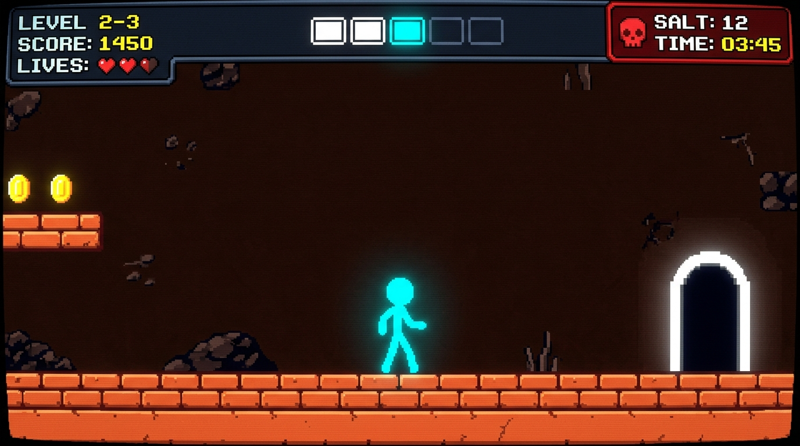

# 💀 DEADGAME - Trap Adventure Edition

> Un jeu de plateforme masocore retro et sadique inspiré de **Trap Adventure 2**, 100% statique et jouable directement dans votre navigateur !



## 🎮 Présentation

**DEADGAME** est un jeu de plateforme 2D ultra-exigeant et plein de surprises sadiques. Vous contrôlez un bonhomme cyan néon qui doit traverser 8 niveaux remplis de pièges fourbes et inattendus. 

Préparez-vous à mourir... beaucoup ! 🧂🔥

## ✨ Fonctionnalités

- 🚪 **8 Niveaux Progressifs** : Des défis au sol de plus en plus intenses.
- 😈 **Pièges Surprise Style Trap Adventure 2** :
  - **Portes Volantes** qui s'enfuient au dernier moment quand vous approchez.
  - **Pics Surprise** qui jaillissent du sol sous vos pieds.
  - **Marches Glissantes** qui vous éjectent dans les pièges.
  - **Tirs Muraux Horizontaux** et **Lasers Verticaux**.
  - **Stalker Orbs** qui vous poursuivent sans relâche.
- ⚡ **Respawn Instantané (150ms)** : Pas de temps mort, réapparition immédiate pour enchaîner les essais.
- 💎 **Visibilité Optimale** : Héros cyan néon lumineux avec contour noir et effet de lueur.
- 🕹️ **Ambiance Rétro CRT & Audio Synthesizer** : Effets sonores 8-bit générés via Web Audio API.
- 🌐 **100% Statique (Sans serveur)** : Fonctionne directement sur navigateur web et idéal pour **GitHub Pages**.

## 🕹️ Commandes

- **Déplacement** : Touches Directionnelles `◄` / `►`
- **Saut** : `▲` (Flèche Haut) / `Espace` / `Z`
- **Recommencer instantanément** : Réapparition automatique lors d'une mort.

## 🚀 Jouer en Ligne

Le jeu est hébergé en ligne sur GitHub Pages :
👉 **[https://raphdespeed.github.io/deadgame/](https://raphdespeed.github.io/deadgame/)**

## 🛠️ Lancer en local

1. Clonez ce dépôt :
   ```bash
   git clone https://github.com/raphdespeed/deadgame.git
   ```
2. Ouvrez simplement le fichier `index.html` dans votre navigateur Web préféré ! Aucune installation ou serveur requis.

---
*Créé avec passion et sadisme pour les amateurs de défis Masocore !*
